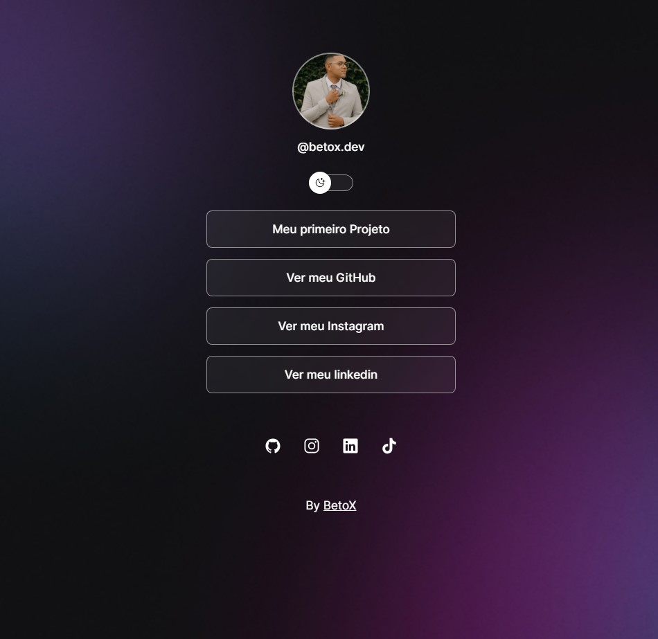

<h1 align="center"> PORTFÓLIO </h1>

Roberto Santos  
<h3 align="center">Técnologo em Análise e Desenvolvimento de Sistemas  
Desenvolvedor Front-end.</h3>

  <a href="#-tecnologias">Tecnologias</a>&nbsp;&nbsp;&nbsp;|&nbsp;&nbsp;&nbsp;
  <a href="#-projeto">Projeto</a>&nbsp;&nbsp;&nbsp;

[Clique aqui para acessar] (https://santosrobertin.github.io/portfolio/)

 

  

## 🚀 Tecnologias

Esse projeto foi desenvolvido com as seguintes tecnologias:

- HTML e CSS
- JavaScript
- Git e Github

 

## 💻 Projeto

Esse projeto foi e está sendo desenvolvido para que seja meu primeiro portfólio.

 

---

by BetoX.dev

